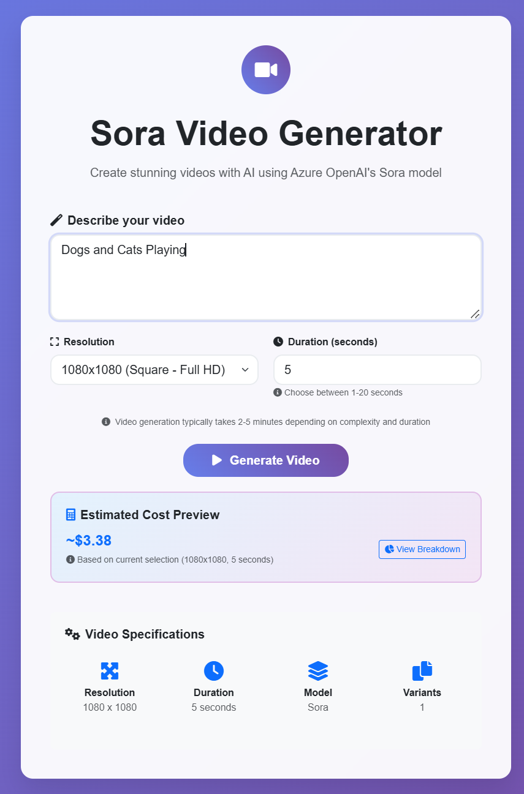
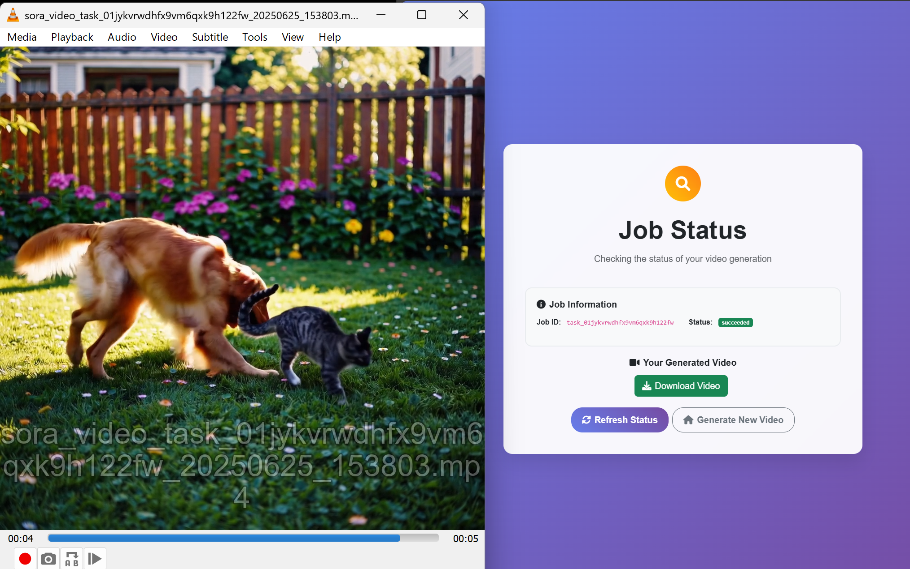

# Sora Video Generator

A Java Spring Boot web application that generates Sora videos using Azure OpenAI API. This application provides a user-friendly web interface for creating AI-generated videos with **configurable video specifications** including resolution and duration.

## See It In Action

Transform your creative ideas into stunning AI-generated videos with just a few clicks. From prompt to playback, experience the power of Azure OpenAI's Sora model through an intuitive web interface.

| **Video Generation Interface** | **Generated Video Output** |
|:------------------------------:|:---------------------------:|
|  |  |
| *Enter your prompt, select resolution and duration, then generate your video with real-time cost estimation* | *Watch your AI-generated video come to life - ready to download and share* |

## Features

- 🎥 **Video Generation**: Create videos using Azure OpenAI's Sora model
- ⚙️ **Configurable Specifications**: Choose from 9 supported resolutions and duration (1-20 seconds)
- 🔧 **Smart Validation**: Automatic restrictions for resolution-specific limitations (e.g., 1920x1080 max 10 seconds)
- 🖥️ **Web Interface**: Modern, responsive UI built with Bootstrap and Thymeleaf
- ⚡ **Reactive Architecture**: Built with Spring WebFlux for optimal performance with 100MB buffer for large video downloads
- 🔒 **Secure**: Uses Azure managed identity for authentication in production
- 📊 **Monitoring**: Includes health checks and logging for production deployment
- 🚀 **Container Ready**: Dockerized for easy deployment to Azure Container Apps
- 💰 **Cost Estimation**: Real-time cost preview and detailed cost breakdown with warnings

## Cost Estimation

The Sora Video Generator includes a comprehensive cost estimation system that provides users with transparent pricing information before and after video generation.

### Real-Time Cost Preview

- **Dynamic Updates**: Cost estimates update automatically as you change resolution and duration settings
- **Interactive Feedback**: See cost changes in real-time on the main form
- **Pre-Generation Awareness**: Know the cost before submitting your video generation request

### Cost Calculation Details

The cost estimator is based on **Azure OpenAI Sora per-second pricing** as of June 2025:

#### **Per-Second Pricing Structure**

| **Resolution / Aspect** | **Cost per Second** |
| ----------------------- | ------------------- |
| **480 Square (480x480)** | $0.15 |
| **480p (480x854, 854x480)** | $0.20 |
| **720 Square (720x720)** | $0.30 |
| **720p (720x1280, 1280x720)** | $0.45 - $0.50* |
| **1080 Square (1080x1080)** | $0.60 - $0.75* |
| **1080p (1080x1920, 1920x1080)** | $1.30 - $1.85* |

**Variable Pricing**: Some resolutions have cost ranges based on duration tiers (1-5s, 6-10s, 11-15s, 16-20s). The application uses average pricing for estimates.

#### **Cost Examples**
| Resolution | Duration | Estimated Cost |
|------------|----------|----------------|
| 480x480 | 5 seconds | $0.75 |
| 720x720 | 10 seconds | $3.00 |
| 1080x1080 | 10 seconds | $6.75 (avg) |
| 1080x1920 | 5 seconds | $8.13 (avg) |
| 1920x1080 | 10 seconds | $15.75 (avg) |

### Cost Breakdown Features

After submitting a video generation request, users receive:

1. **Detailed Cost Information**
   - Total estimated cost for the specific video
   - Per-second breakdown showing calculation method
   - Resolution and duration specifications

2. **Cost Warnings**
   - Alerts for high-cost configurations (>$8.00)
   - Notifications for very expensive requests (>$15.00)
   - Critical alerts for extremely expensive requests (>$25.00)
   - Recommendations for cost optimization

3. **Transparent Billing Information**
   - Clear notes about when charges occur
   - Information about potential cost variations
   - Links to current Azure pricing documentation

### Cost Estimation API

The application includes a dedicated `CostEstimationService` that:

- Calculates costs based on current pricing models
- Provides detailed breakdown strings for user display
- Generates appropriate warnings for expensive configurations
- Supports future pricing model updates

#### **Service Features**
```java
// Real-time cost calculation
public BigDecimal calculateCost(int width, int height, int duration)

// Detailed cost breakdown for display
public String generateCostBreakdown(VideoRequest request, BigDecimal cost)

// Cost warnings for expensive requests
public String generateCostWarning(BigDecimal cost)
```

### Cost Optimization Tips

1. **Start Small**: Begin with shorter durations (3-5 seconds) and lower resolutions to minimize costs
2. **Choose Appropriate Resolution**: 
   - Use 480x480 ($0.15/sec) for testing and prototyping
   - Use 720x720 ($0.30/sec) for good quality at moderate cost
   - Reserve 1080p ($1.30-$1.85/sec) for final production videos
3. **Preview Costs**: Always check the cost estimate - 1080p videos can cost $6.50-$37+ depending on duration
4. **Duration Management**: Even 10 seconds at 1080p costs $13-$18.50
5. **Batch Processing**: Plan multiple shorter videos rather than one long expensive video

### Pricing Accuracy Disclaimer

**Important**: Cost estimates are based on **Azure OpenAI Sora pricing as of June 2025** and reflect the most current per-second pricing structure. Actual costs may vary based on:

- Azure region selection
- Subscription type and discounts
- Current Azure AI Studio pricing
- Promotional pricing or credits

Always verify current pricing through the Azure portal before generating expensive videos.

## Architecture

- **Backend**: Java 17 + Spring Boot 3.5.0 with dotenv-java for environment variable loading
- **Frontend**: Thymeleaf templates with Bootstrap 5
- **HTTP Client**: Spring WebFlux for reactive API calls
- **Configuration**: Environment-based configuration with no hardcoded URLs
- **Deployment**: Azure Container Apps with Container Registry
- **Monitoring**: Spring Boot Actuator with Azure Log Analytics

## Getting Started

### Prerequisites

- Java 17 or later
- Maven 3.6 or later
- Azure OpenAI API access with Sora model, once deployed you can get the instance target URI, but you must remove the "/openai/v1/video/generations/jobs?api-version=preview"
- Azure CLI (for deployment)
- Azure Developer CLI (recommended)

### Local Development

1. **Clone the repository**
   ```bash
   git clone <repository-url>
   cd sora-video-generator
   ```

2. **Set up environment variables**
   Create a `.env` file in the root directory with your Azure OpenAI credentials:
   ```bash
   # Azure OpenAI Configuration
   AZURE_OPENAI_ENDPOINT=https://your-resource.cognitiveservices.azure.com
   AZURE_OPENAI_API_KEY=your_api_key_here
   AZURE_OPENAI_API_VERSION=preview

   # Azure Configuration
   AZURE_ENV_NAME=your-env-name
   AZURE_LOCATION=eastus

   # Application Configuration
   SERVER_PORT=8080
   SPRING_PROFILES_ACTIVE=dev
   ```

   > **Important**: Use only the base URL for the endpoint (e.g., `https://your-resource.cognitiveservices.azure.com`). Do **not** include the full API path like `/openai/v1/video/generations/jobs?api-version=preview`.

3. **Environment Variable Loading**
   The application automatically loads environment variables from the `.env` file using the dotenv-java library. No manual configuration of `application.properties` is required - all sensitive configuration is handled through environment variables for security. 

4. **Run the application**
   ```bash
   ./mvnw spring-boot:run
   ```

5. **Access the application**
   Open your browser and go to `http://localhost:8080`

### Building for Production

1. **Build the JAR file**
   ```bash
   ./mvnw clean package
   ```

2. **Build Docker image**
   ```bash
   docker build -t sora-video-generator .
   ```

## Deployment to Azure

This application is designed to be deployed to Azure Container Apps using Azure Developer CLI.

### Using Azure Developer CLI (Recommended)

1. **Install Azure Developer CLI**
   ```bash
   # Windows (PowerShell)
   winget install Microsoft.AzureDeveloperCLI
   
   # macOS
   brew tap azure/azd && brew install azd
   
   # Linux
   curl -fsSL https://aka.ms/install-azd.sh | bash
   ```

2. **Initialize the project**
   ```bash
   azd init
   ```

3. **Set environment variables**
   ```bash
   azd env set AZURE_OPENAI_ENDPOINT "https://your-resource.cognitiveservices.azure.com"
   azd env set AZURE_OPENAI_API_KEY "your_api_key_here"
   azd env set AZURE_OPENAI_API_VERSION "preview"
   azd env set AZURE_LOCATION "eastus"
   ```

   > **Important**: Use only the base URL for the endpoint (e.g., `https://your-resource.cognitiveservices.azure.com`). Do **not** include the full API path like `/openai/v1/video/generations/jobs?api-version=preview`. 

4. **Deploy to Azure**
   ```bash
   azd up
   ```

### Manual Deployment

1. **Create Azure resources**
   ```bash
   az group create --name rg-sora-video --location eastus
   az deployment group create --resource-group rg-sora-video --template-file infra/main.bicep --parameters @infra/main.parameters.json
   ```

2. **Build and push container image**
   ```bash
   az acr build --registry <your-acr-name> --image sora-video-generator:latest .
   ```

3. **Update container app**
   ```bash
   az containerapp update --name <your-container-app> --resource-group rg-sora-video --image <your-acr-name>.azurecr.io/sora-video-generator:latest
   ```

## Configuration

### Environment Variables

The application uses environment variables for all configuration to ensure security and flexibility across different environments (local development, Azure deployment). All sensitive configuration is loaded from `.env` files locally or Azure environment variables in production.

| Variable | Description | Default |
|----------|-------------|---------|
| `AZURE_OPENAI_ENDPOINT` | Azure OpenAI service endpoint (base URL only) | Required |
| `AZURE_OPENAI_API_KEY` | Azure OpenAI API key | Required |
| `AZURE_OPENAI_API_VERSION` | API version | `preview` |
| `SERVER_PORT` | Application port | `8080` |
| `SPRING_PROFILES_ACTIVE` | Spring profile | `dev` |
| `AZURE_ENV_NAME` | Azure environment name | Required for deployment |
| `AZURE_LOCATION` | Azure region | Required for deployment |

### No Hardcoded URLs

The application follows security best practices by:
- Using environment variables for all external service URLs
- Loading configuration from `.env` files locally using dotenv-java
- Using Azure environment variables in production deployment
- Never storing sensitive information in source code or configuration files

### Video Generation Parameters

The application supports configurable parameters for video generation:

#### **Supported Resolutions**
- 480x480 (Square - Small)
- 480x854 (Portrait)
- 854x480 (Landscape)
- 720x720 (Square - HD)
- 720x1280 (Portrait - HD)
- 1280x720 (Landscape - HD)
- 1080x1080 (Square - Full HD) - *Default*
- 1080x1920 (Portrait - Full HD)
- 1920x1080 (Landscape - Full HD) - *Limited to 10 seconds max*

#### **Duration Settings**
- **Standard Resolutions**: 1-20 seconds
- **1920x1080 Resolution**: 1-10 seconds (API limitation)
- **Default**: 5 seconds

#### **Other Parameters**
- **Variants**: 1 (fixed)
- **Model**: Sora (latest)

## Usage

1. **Access the web interface** at your deployed URL or `http://localhost:8080`
2. **Enter a prompt** describing the video you want to generate
3. **Select resolution** from the dropdown (9 options available)
4. **Set duration** between 1-20 seconds (or 1-10 for 1920x1080)
5. **Review cost estimate** displayed in real-time as you adjust settings
6. **Click "Generate Video"** to start the process and see detailed cost breakdown
7. **Check the status** of your video generation job
8. **Download the video** once generation is complete

### Cost Awareness Tips

- **Monitor Real-Time Costs**: Watch the cost estimate update as you change settings - 1080p can quickly become expensive
- **Cost Warnings**: Pay attention to warnings for expensive configurations (>$8.00, >$15.00, >$25.00)
- **Resolution Impact**: Higher resolutions have dramatically higher costs (480p: $0.15/sec vs 1080p: $1.30-$1.85/sec)
- **Duration Impact**: Every second matters - a 20-second 1080p video can cost $26-$37
- **Billing Information**: You're only charged for successful video generation

### Video Specification Guidelines

- **Square formats** (480x480, 720x720, 1080x1080): Best for social media posts
- **Portrait formats** (480x854, 720x1280, 1080x1920): Ideal for mobile content and stories
- **Landscape formats** (854x480, 1280x720, 1920x1080): Perfect for traditional video content
- **Duration recommendations**: Start with shorter durations (5-10 seconds) for better quality
- **1920x1080 limitation**: Maximum 10 seconds due to API restrictions

## API Endpoints

- `GET /` - Main video generation form
- `POST /generate` - Submit video generation request
- `GET /status/{jobId}` - View job status page
- `GET /api/status/{jobId}` - Get job status (JSON)
- `GET /actuator/health` - Health check endpoint

## Monitoring and Logging

The application includes comprehensive monitoring:

- **Health Checks**: `/actuator/health` endpoint
- **Readiness Probe**: `/actuator/health/readiness`
- **Liveness Probe**: `/actuator/health/liveness`
- **Logging**: Configured for Azure Log Analytics

## Security

- Environment variables for sensitive configuration
- CORS policy configured for web interface
- Container runs as non-root user
- Azure managed identity for production authentication

## Development

### Project Structure

```
src/
├── main/
│   ├── java/com/example/soravideogenerator/
│   │   ├── SoraVideoGeneratorApplication.java
│   │   ├── config/
│   │   │   └── AzureOpenAIConfig.java
│   │   ├── controller/
│   │   │   └── VideoController.java
│   │   ├── model/
│   │   │   ├── VideoRequest.java
│   │   │   ├── VideoResponse.java
│   │   │   ├── SoraApiRequest.java
│   │   │   └── SoraApiResponse.java
│   │   └── service/
│   │       ├── SoraVideoService.java
│   │       └── CostEstimationService.java
│   └── resources/
│       ├── application.properties
│       └── templates/
│           ├── index.html
│           ├── result.html
│           ├── status.html
│           └── error.html
├── test/
└── ...
```

### Key Components

- **VideoController**: Handles web requests and form submissions with configurable video specifications and cost estimation
- **SoraVideoService**: Manages video generation API calls with user-selected parameters
- **CostEstimationService**: Calculates costs, generates breakdowns, and provides cost warnings for video generation requests
- **AzureOpenAIConfig**: Configuration for Azure OpenAI WebClient with 100MB buffer for large video downloads - uses environment variables for all endpoints and API keys
- **EnvironmentConfig**: Static configuration loader that ensures `.env` files are loaded before Spring Boot starts
- **Model Classes**: Request/response DTOs with validation for resolution-duration combinations
- **Custom Validation**: Enforces API restrictions (e.g., 1920x1080 max 10 seconds)

## Troubleshooting

### Common Issues

1. **Azure OpenAI API Key Issues**
   - Verify your API key is correct and has Sora access
   - Check endpoint URL format (use base URL only, not full API path)
   - Ensure environment variables are properly set in `.env` file or Azure environment
   - Verify that Azure environment and local `.env` use the same endpoint

2. **Container App Deployment Issues**
   - Check container registry permissions
   - Verify managed identity configuration
   - Review application logs in Azure portal
   - Ensure Azure location consistency between environment variables and existing resources

3. **Environment Variable Loading Issues**
   - Verify `.env` file is in the project root directory
   - Check that environment variables are correctly set in Azure (use `azd env get-values`)
   - Ensure no hardcoded URLs remain in configuration files
   - Verify dotenv-java dependency is included in Maven build

3. **Video Generation Timeouts**
   - Video generation can take 2-5 minutes
   - Check job status regularly
   - Ensure adequate timeout settings

4. **Video Download Buffer Errors**
   - Application configured with 100MB buffer for large video files
   - If encountering buffer limit issues, videos may be too large
   - Try shorter durations or lower resolutions

5. **Resolution-Duration Restrictions**
   - 1920x1080 resolution limited to maximum 10 seconds
   - Frontend automatically enforces these restrictions
   - Backend validation prevents invalid combinations

### Logs

View application logs:
```bash
# Azure Developer CLI
azd logs

# Azure CLI
az containerapp logs show --name <app-name> --resource-group <rg-name>
```

## License

This project is licensed under the MIT License. See the LICENSE file for details.

## Support

For issues and questions:
- Check the troubleshooting section
- Review Azure OpenAI documentation
- Open an issue in the repository
